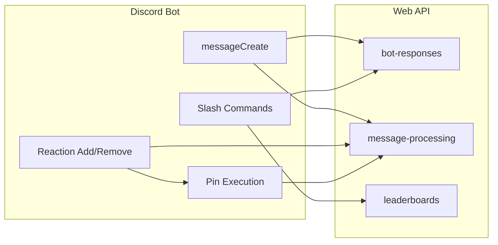

# Discord bot to Web API migration – remaining work

[TODO.md](TODO.md) is the source of truth. The API already has the logic for **Take a look**, **Fortune**, **Twitter/social link fixer**, **emoji counting**, **plus/minus in messages**, and **repost count**. Nothing in the bot currently calls the API; everything uses local DB/utilities.

---

## 1. Web API – missing backend pieces

### 1.1 Leaderboards / stats (read-only) – **not in API yet**

All slash commands today read from the bot’s DB. The API needs equivalent read endpoints so the bot can call them and format Discord replies.

| Bot command / data          | Current source                                                                       | API work                                                                                        |
| --------------------------- | ------------------------------------------------------------------------------------ | ----------------------------------------------------------------------------------------------- |
| `/plusplus-leaderboard`     | [database/plusplus.js](database/plusplus.js) `getTopScores(5)`, `getBottomScores(5)` | New service + route: e.g. `GET /api/leaderboards/plusplus?top=5&bottom=5` → `{ top, bottom }`   |
| `/plusplus-total`           | `getTotalScoreByString(string, type)`                                                | e.g. `GET /api/leaderboards/plusplus/total?string=&type=word                                    |
| `/plusplus-voter-frequency` | `getVotesById(voterId)`                                                              | e.g. `GET /api/leaderboards/plusplus/voter-frequency?userId=` → `{ total }`                     |
| `/plusplus-top-voters`      | `getTopVoters(3)`                                                                    | Include in plusplus leaderboard response or `GET /api/leaderboards/plusplus/top-voters?limit=3` |
| `/top-emojis`               | [database/emojis.js](database/emojis.js) `getTopEmoji(5)`                            | e.g. `GET /api/leaderboards/emojis?limit=5` → `[{ emoji, frequency, emoid, animated }, ...]`    |
| `/top-reposters`            | `getTopReposters(5)`                                                                 | e.g. `GET /api/leaderboards/reposts?limit=5` → `[{ userid, count }, ...]`                       |
| `/reposts-by-user`          | `getRepostsForUser(userId)`                                                          | e.g. `GET /api/leaderboards/reposts/by-user?userId=` → `{ count }`                              |

- **Location**: New route file e.g. [webapi/routes/leaderboards.js](webapi/routes/leaderboards.js) (or `stats.js`) and a small service that runs the same queries the bot’s [database/plusplus.js](database/plusplus.js) and [database/emojis.js](database/emojis.js) use (SUM/COUNT/ORDER BY/LIMIT). Reuse [webapi/config/db.js](webapi/config/db.js).
- **Auth**: Use existing `authenticate` middleware (Bearer JWT).

### 1.2 PlusPlus reaction vote – **single-vote endpoint**

- **Current**: On reaction add/remove, [bot.js](bot.js) calls `doplus` / `dominus` from [events/messages/utilities/plusplus.js](events/messages/utilities/plusplus.js) → [database/plusplus.js](database/plusplus.js) (direct INSERT).
- **API**: [webapi/services/messageProcessing.js](webapi/services/messageProcessing.js) already has `recordPlusPlus(string, typestr, voterid, value)` used by `recordPlusMinusMessage` and by `countEmoji` (reply +/-). There is no HTTP endpoint for “one reaction vote”.
- **Add**: e.g. `POST /api/message-processing/plusplus-vote` with body `{ string, type: "user"|"word", voterId, value: 1 | -1 }`. Implement self-vote check (if type === "user" && string === voterId → 400 or no-op). Call `recordPlusPlus` and return `{ ok: true }`.

### 1.3 Pin decision + pin log – **not in API yet**

- **Current**: [events/messages/utilities/messagePinner.js](events/messages/utilities/messagePinner.js) uses [logging/dataLog.js](logging/dataLog.js): `isMessageAlreadyPinned(message.id)` and `logPinnedMessage(message.id)`. Pin execution (pin + embed to pin channel) stays in the bot.
- **API**: Add pin logic and DB access in the web API:
  - **Tables**: `pin_history` already exists in [webapi/scripts/mysql/initialize.js](webapi/scripts/mysql/initialize.js) (and sqlite setup). Ensure schema is applied in the DB the API uses.
  - **Service**: Two functions: (1) `isMessageAlreadyPinned(msgId)` (SELECT on `pin_history`); (2) `logPinnedMessage(msgId)` (INSERT into `pin_history`). Optionally a single “pin decision” that returns `{ shouldPin, alreadyPinned }` (shouldPin = !alreadyPinned when reaction count >= threshold; threshold can be read from config in API or passed in).
  - **Route**: e.g. `POST /api/message-processing/pin-check` body `{ messageId }` → `{ alreadyPinned: boolean }`; and `POST /api/message-processing/pin-log` body `{ messageId }` → `{ ok: true }` (only inserts if not already pinned). Or one combined: `POST /api/message-processing/pin-decision` with `{ messageId, reactionCount, pinThreshold }` returning `{ shouldPin, alreadyPinned }`, and when bot actually pins it calls `POST .../pin-log` so the API records it.

### 1.4 Optional: emoji import on startup

- **Current**: [bot.js](bot.js) on `ClientReady` calls `importEmojiList(emojis)` from [database/emojis.js](database/emojis.js) (clears zero-frequency emojis, then INSERT guild emojis).
- **Optional**: Add e.g. `POST /api/message-processing/emoji-import` that accepts `{ emojis: [{ id, name, animated, type }] }` and performs the same upsert/cleanup in the API DB. Bot would call this once on ready instead of using local DB. If not done, the bot would need to keep DB access only for this, or run import from a one-off script that talks to the API.

---

## 2. Bot – wire to API and remove DB

### 2.1 API client and auth

- **Config**: Add env vars for API base URL and bot auth, e.g. `API_BASE_URL`, `API_ADMIN_USERNAME`, `API_ADMIN_PASSWORD` (same as API’s `ADMIN_USERNAME` / `ADMIN_PASSWORD`), or a pre-issued token if you add bot-token auth later.
- **Client**: Add an HTTP client (e.g. `axios` or `node-fetch`) and a small module (e.g. `apiClient.js`) that:
  - On first use (or startup): POST to `/api/auth/login` with admin credentials, get JWT, cache it (and optionally refresh before expiry).
  - Exposes methods that send requests with `Authorization: Bearer <token>` to the existing and new endpoints.
- **Auth note**: Current [webapi/middleware/auth.js](webapi/middleware/auth.js) restricts to the single admin user; using the same admin for the bot is the minimal change. Alternatively add a dedicated “bot” auth (e.g. API key or second user) and relax middleware for server-to-server.

### 2.2 Message handlers – use API instead of local DB

- **Take a look**: In [events/messages/messageCreate.js](events/messages/messageCreate.js), when trigger phrase detected, call `POST /api/bot-responses/take-a-look`; reply with `response` (URL or "No spam!"); do not reply when `response === ""`.
- **Fortune**: When @bot + `?`, call `POST /api/bot-responses/fortune`; reply with `response`.
- **Link fixer**: When social link + trigger word, call `POST /api/bot-responses/link-fixer` with `{ message: message.content }`; if `response` non-empty, reply with it.
- **Emoji in messages**: Replace [events/messages/utilities/emojiDetector.js](events/messages/utilities/emojiDetector.js) usage: build payload (authorId, emojis from content, isReply, repliedUserId) and call `POST /api/message-processing/emoji-count`. No need to call doplus/dominus from the bot for in-message +/-; the API’s emoji-count already handles reply +/-.
- **Plus/minus in message text**: Replace [events/messages/utilities/plusplus.js](events/messages/utilities/plusplus.js) `plusMinusMsg` with `POST /api/message-processing/plusminus` with body `{ message: { content, author: { id } }, voterId: message.author.id }`. No reply needed from API for this.

### 2.3 Reaction handlers – use API

- **Pin**: In `messageReactionAdd`, when pin emoji count reaches threshold, call API `pin-check` (or `pin-decision`); if `shouldPin` and not `alreadyPinned`, then call `pin-log`, then perform pin and send embed (unchanged Discord calls in [messagePinner.js](events/messages/utilities/messagePinner.js)). Optionally pass threshold from config; if config is only in API, add a small “get config” endpoint or pass threshold from bot env.
- **Plus/Minus by reaction**: Replace `doplus`/`dominus` with `POST /api/message-processing/plusplus-vote` with `{ string: message.author.id, type: "user", voterId: user.id, value: 1 }` or `-1`. On reaction remove, send `value: -1` for plus (undo plus = minus) and `value: 1` for minus (undo minus = plus) — i.e. same endpoint, value opposite to the reaction that was removed.
- **Emoji frequency (other reactions)**: Build payload (authorId = reactor, emojis = [reaction emoji], no reply). Call `POST /api/message-processing/emoji-count`. Skip when reaction is pin / plus / minus / repost emoji.
- **Repost**: On add, call `POST /api/message-processing/count-repost` with `{ userid, msgid, accuser, msgcontents?, repost: 1 }`. On remove, same with `repost: -1`.

### 2.4 Slash commands – use API

- Replace every direct DB call in [commands/utilities/](commands/utilities/) with the corresponding API call:
  - [plusplus-leaderboard.js](commands/utilities/plusplus-leaderboard.js) → GET leaderboards plusplus (top/bottom).
  - [plusplus-total.js](commands/utilities/plusplus-total.js) → GET plusplus total (word and/or user).
  - [plusplus-voter.js](commands/utilities/plusplus-voter.js) → GET voter frequency.
  - [plusplus-top-voters.js](commands/utilities/plusplus-top-voters.js) → GET top voters.
  - [emoji-leaderboards.js](commands/utilities/emoji-leaderboards.js) → GET top emojis.
  - [repost-leaderboards.js](commands/utilities/repost-leaderboards.js) → GET top reposters (and repost emoji id from config or env for embed).
  - [reposts-by-user.js](commands/utilities/repost-by-user.js) → GET reposts by user.
- Keep [dixbot.js](commands/utilities/dixbot.js) as-is (static text; optional to serve from API later).

### 2.5 Startup and cleanup

- **Emoji import**: Either call new `POST /api/message-processing/emoji-import` with guild emojis on ready, or leave current `importEmojiList` and keep minimal DB access for that only (not recommended if goal is “bot no longer touches DB”).
- **Config**: Bot still needs Discord-side config (pin_channel_id, pin_emoji, pin_threshold, repost_emoji, plus/minus emoji, etc.). Either keep reading from env or add GET config endpoint and have bot fetch once on ready.
- **Remove**: After migration, remove bot’s direct DB usage: [database/](database/) (queryRunner, plusplus, emojis, configurations, responses, filters, import, initialize), [logging/dataLog.js](logging/dataLog.js), and any remaining imports of these from [bot.js](bot.js), [messageCreate.js](events/messages/messageCreate.js), [messagePinner.js](events/messages/utilities/messagePinner.js), and command files. Bot’s [configVars.js](configVars.js) can drop MySQL vars if the bot no longer connects to DB; keep DISCORD_*, add API_*.

---

## 3. Consistency and schema

- **Instagram link**: Bot’s [twitterFixer.js](events/messages/responses/twitterFixer.js) uses `ddinstagram.com`; [webapi/services/botResponses.js](webapi/services/botResponses.js) uses `jgram.jtav.me`. Align to one (either in API or bot config).
- **plusplus_tracking.value**: Bot uses numeric 1/-1; [webapi/sql/schema.sql](webapi/sql/schema.sql) has `value VARCHAR(500)`. Prefer INT in schema and code so SUM(value) is unambiguous across DBs.
- **eight_ball_responses**: Bot DB has typo `resoponse_string` in [database/responses.js](database/responses.js); API already handles both in [botResponses.js](webapi/services/botResponses.js). No change required if same DB; if migrating to API-only DB, use correct column name.

---

## 4. Summary diagram

- **Already in API**: take-a-look, fortune, link-fixer; emoji-count, plusminus, count-repost.
- **To add in API**: leaderboards (plusplus, emojis, reposts); plusplus-vote; pin-check + pin-log (or pin-decision).
- **Bot**: Add API client + auth; replace all DB/response logic with API calls; keep Discord-only actions (send message, pin, post embed).

---

## 5. Suggested order of work

1. **API**: Add leaderboards service + routes; add plusplus-vote route; add pin-check + pin-log (or pin-decision) service + routes.
2. **Bot**: Add API client and env; switch message handlers (take a look, fortune, link fixer, emoji, plusminus) to API.
3. **Bot**: Switch reaction handlers (plus/minus, emoji, repost, pin) to API.
4. **Bot**: Switch all slash commands to API.
5. **Bot**: Optional emoji-import endpoint + call on ready; then remove DB and related code from bot.
6. **Cleanup**: Align Instagram domain and plusplus `value` type; update TODO.md checkboxes.

